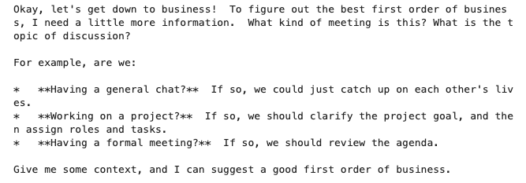
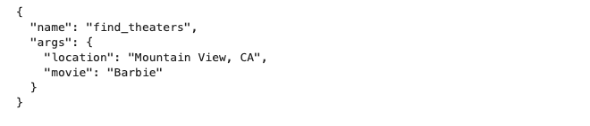

# GCP-LAB-Getting-Started-with-the-Gemini-API-in-Vertex-AI-with-cURL
Getting Started with the Gemini API in Vertex AI with cURL

##### Overview
In this lab, you learn how to use the Gemini API in Vertex AI with cURL commands to interact with the Gemini 2.0 Flash (gemini-2.0-flash) model. You will learn how to generate text from a prompt, add model parameters, chat, and generate text from images and video.

##### Gemini
Gemini is a family of powerful generative AI models developed by Google DeepMind, capable of understanding and generating various forms of content, including text, code, images, audio, and video.

###### Gemini API in Vertex AI
The Gemini API in Vertex AI provides a unified interface for interacting with Gemini models. This allows developers to easily integrate these powerful AI capabilities into their applications. For the most up-to-date details and specific features of the latest versions, please refer to the official Gemini documentation.

###### Gemini Models
- Gemini Pro: Designed for complex reasoning, including:
. Analyzing and summarizing large amounts of information.
. Sophisticated cross-modal reasoning (across text, code, images, etc.).
. Effective problem-solving with complex codebases.

###### Gemini Flash: Optimized for speed and efficiency, offering:
. Sub-second response times and high throughput.
. High quality at a lower cost for a wide range of tasks.
. Enhanced multimodal capabilities, including improved spatial understanding, new output modalities (text, audio, images), and native tool use (Google Search, code execution, and third-party functions).


###### Prerequisites

Before starting this lab, you should be familiar with:

. Basic Python programming.
. General API concepts.
. Running Python code in a Jupyter notebook on Vertex AI Workbench.


##### Objectives

In this lab, you will learn how to perform the following tasks:

. Install the Python SDK
. Use the Gemini API in Vertex AI to interact with each model
. Use the Gemini 2.0 Flash (gemini-2.0-flash) model to generate text from image(s), text prompts and video


### Task 1. Open the notebook in Vertex AI Workbench

1. In the Google Cloud console, on the Navigation menu (Navigation menu icon), click Vertex AI > Workbench.

2. Find the vertex-ai-jupyterlab instance and click on the Open JupyterLab button.

The JupyterLab interface for your Workbench instance opens in a new browser tab


### Task 2. Set up the notebook

1. Open the intro_gemini_curl file.

2. In the Select Kernel dialog, choose Python 3 from the list of available kernels.

3. Run through the Getting Started and the Import libraries sections of the notebook.

. For Project ID, use qwiklabs-gcp-04-891d7d611f07, and for Location, use europe-west4.


##### Getting Started

###### Install required libraries

```
%%capture

!sudo apt install -q jq
```

###### Restart current runtime
To use the newly installed packages in this Jupyter runtime, you must restart the runtime. You can do this by running the cell below, which will restart the current kernel.

```
# Restart kernel after installs so that your environment can access the new packages
import IPython

app = IPython.Application.instance()
app.kernel.do_shutdown(True)
```

###### Set Google Cloud project
To get started using Vertex AI, you must have an existing Google Cloud project and enable the Vertex AI API.

Learn more about setting up a project and a development environment.


```
# Define project information
PROJECT_ID = "qwiklabs-gcp-04-891d7d611f07"  # @param {type:"string"}
LOCATION = "europe-west4"  # @param {type:"string"}

# Import libraries
import os
```

###### Use the Gemini 2.0 Flash model

```
MODEL_ID = "gemini-2.0-flash"
API_HOST = f"{LOCATION}-aiplatform.googleapis.com"

os.environ["API_ENDPOINT"] = (
    f"{API_HOST}/v1/projects/{PROJECT_ID}/locations/{LOCATION}/publishers/google/models/{MODEL_ID}"
)
```


### Task 3. Use the Gemini Flash Model
Gemini 2.0 Flash (gemini-2.0-flash) model is tailored for natural language tasks such as classification, summarization, extraction, and writing. In this task, you will learn how to use the Gemini 2.0 Flash to generate text from a prompt.

In this task, run through the notebook cells to see how to use the Gemini Flash model to generate text from a text prompt.

##### Text generation
The generateContent method can handle a wide variety of use cases, including multi-turn chat and multimodal input, depending on what the underlying model supports. In this example, you send a text prompt and request the model response in text.


```
%%bash

curl -X POST \
  -H "Authorization: Bearer $(gcloud auth print-access-token)" \
  -H "Content-Type: application/json" \
  https://${API_ENDPOINT}:generateContent \
  -d '{
    "contents": {
      "role": "USER",
      "parts": { "text": "Why is the sky blue?" },
    },
    "generation_config": {
      "response_modalities": "TEXT",
     },
  }' 2>/dev/null >response.json

jq -r ".candidates[].content.parts[].text" response.json

```


##### Streaming
The Gemini API provides a streaming response mechanism. With this approach, you don't need to wait for the complete response; you can start processing fragments as soon as they're accessible.


```
%%bash

curl -X POST \
  -H "Authorization: Bearer $(gcloud auth print-access-token)" \
  -H "Content-Type: application/json" \
  https://${API_ENDPOINT}:streamGenerateContent \
 \
  -d '{
    "contents": {
      "role": "USER",
      "parts": { "text": "Why is the sky blue?" }
    }
  }' 2>/dev/null >response.json

jq -r ".[] | .candidates[] | .content.parts[].text" response.json
```


##### Model parameters
Every prompt you send to the model includes parameter values that control how the model generates a response. The model can generate different results for different parameter values. You can experiment with different model parameters to see how the results change.

```
%%bash

curl -X POST \
  -H "Authorization: Bearer $(gcloud auth print-access-token)" \
  -H "Content-Type: application/json" \
  https://${API_ENDPOINT}:generateContent \
  -d '{
    "contents": {
      "role": "USER",
      "parts": [
        {"text": "Tell me a story."}
      ]
    },
    "generation_config": {
      "temperature": 0.2,
      "top_p": 0.1,
      "top_k": 16,
      "max_output_tokens": 2048,
      "candidate_count": 1,
      "stop_sequences": []
    },
    "safety_settings": {
      "category": "HARM_CATEGORY_SEXUALLY_EXPLICIT",
      "threshold": "BLOCK_LOW_AND_ABOVE"
    }
  }' 2>/dev/null >response.json

jq -r ".candidates[].content.parts[].text" response.json
```


##### Chat
The Gemini API supports natural multi-turn conversations and is ideal for text tasks that require back-and-forth interactions.

Specify the role field only if the content represents a turn in a conversation. You can set role to one of the following values: user, model.

```
%%bash

curl -X POST \
  -H "Authorization: Bearer $(gcloud auth print-access-token)" \
  -H "Content-Type: application/json" \
  https://${API_ENDPOINT}:generateContent \
  -d '{
    "contents": [
      {
        "role": "user",
        "parts": [
          { "text": "Hello" }
        ]
      },
      {
        "role": "model",
        "parts": [
          { "text": "Hello! I am glad you could both make it." }
        ]
      },
      {
        "role": "user",
        "parts": [
          { "text": "So what is the first order of business?" }
        ]
      }
    ]
  }' 2>/dev/null >response.json

jq -r ".candidates[].content.parts[].text" response.json
```




##### Function calling
Function calling lets you create a description of a function in their code, then pass that description to a language model in a request. This sample is an example of passing in a description of a function that returns information about where a movie is playing. Several function declarations are included in the request, such as find_movies and find_theaters.

Learn more about function calling.


```
%%bash

curl -X POST \
  -H "Authorization: Bearer $(gcloud auth print-access-token)" \
  -H "Content-Type: application/json" \
  https://${API_ENDPOINT}:generateContent \
  -d '{
  "contents": {
    "role": "user",
    "parts": {
      "text": "Which theaters in Mountain View show Barbie movie?"
    }
  },
  "tools": [
    {
      "function_declarations": [
        {
          "name": "find_movies",
          "description": "find movie titles currently playing in theaters based on any description, genre, title words, etc.",
          "parameters": {
            "type": "object",
            "properties": {
              "location": {
                "type": "string",
                "description": "The city and state, e.g. San Francisco, CA or a zip code e.g. 95616"
              },
              "description": {
                "type": "string",
                "description": "Any kind of description including category or genre, title words, attributes, etc."
              }
            },
            "required": [
              "description"
            ]
          }
        },
        {
          "name": "find_theaters",
          "description": "find theaters based on location and optionally movie title which are is currently playing in theaters",
          "parameters": {
            "type": "object",
            "properties": {
              "location": {
                "type": "string",
                "description": "The city and state, e.g. San Francisco, CA or a zip code e.g. 95616"
              },
              "movie": {
                "type": "string",
                "description": "Any movie title"
              }
            },
            "required": [
              "location"
            ]
          }
        },
        {
          "name": "get_showtimes",
          "description": "Find the start times for movies playing in a specific theater",
          "parameters": {
            "type": "object",
            "properties": {
              "location": {
                "type": "string",
                "description": "The city and state, e.g. San Francisco, CA or a zip code e.g. 95616"
              },
              "movie": {
                "type": "string",
                "description": "Any movie title"
              },
              "theater": {
                "type": "string",
                "description": "Name of theater"
              },
              "date": {
                "type": "string",
                "description": "Date for requested showtime"
              }
            },
            "required": [
              "location",
              "movie",
              "theater",
              "date"
            ]
          }
        }
      ]
    }
  ]
}' 2>/dev/null >response.json

jq -r ".candidates[].content.parts[].functionCall" response.json
```




### Task 4. Multimodal input
The Gemini 2.0 Flash (gemini-2.0-flash) is a multimodal model that supports adding images and videos in text or chat prompts for a text response.

In this task, run through the notebook cells to see how to use the Gemini 2.0 Flash model to generate text from an image from a local file, an image from Google Cloud Storage, and a video file.

##### Multimodal input
Gemini is a multimodal model that supports adding image and video in text or chat prompts for a text response.

###### Download an image from Google Cloud Storage

`! gsutil cp "gs://cloud-samples-data/generative-ai/image/320px-Felis_catus-cat_on_snow.jpg" ./image.jpg`


###### Generate text from a local image
Specify the base64 encoding of the image or video to include inline in the prompt and the mime_type field. The supported MIME types for images include image/png and image/jpeg.


```
%%bash

# Encode image data in base64
image_file="image.jpg"
if [[ -f "$image_file" ]]; then
  if command -v base64 &> /dev/null; then
    # base64 is available
    if [[ "$(uname -s)" == "Darwin" ]]; then
      # macOS -b 0 to avoid line wrapping
      data=$(base64 -b 0 -i "$image_file")
    else
      # Linux -w 0 to avoid line wrapping
      data=$(base64 -w 0 "$image_file")
    fi
  else
    echo "Error: base64 command not found."
    exit 1
  fi
else
  echo "Error: Image file '$image_file' not found."
  exit 1
fi

curl -X POST \
  -H "Authorization: Bearer $(gcloud auth print-access-token)" \
  -H "Content-Type: application/json" \
  https://${API_ENDPOINT}:generateContent \
  -d "{
      'contents': {
        'role': 'USER',
        'parts': [
          {
            'text': 'Is it a cat?'
          },
          {
            'inline_data': {
              'data': '${data}',
              'mime_type':'image/jpeg'
            }
          }
        ]
       }
    }" 2>/dev/null >response.json

jq -r ".candidates[].content.parts[].text" response.json
```
>Yes, the image shows a cat. It appears to be a tabby cat, based on its coat pattern.


#### Generate text from an image on Google Cloud Storage
Specify the Cloud Storage URI of the image to include in the prompt. The bucket that stores the file must be in the same Google Cloud project that's sending the request. You must also specify the mime_type field. The supported image MIME types include image/png and image/jpeg.

```
%%bash

curl -X POST \
  -H "Authorization: Bearer $(gcloud auth print-access-token)" \
  -H "Content-Type: application/json" \
  https://${API_ENDPOINT}:generateContent \
  -d '{
    "contents": {
      "role": "USER",
      "parts": [
        {
          "text": "Describe this image"
        },
        {
          "file_data": {
            "mime_type": "image/png",
            "file_uri": "gs://cloud-samples-data/generative-ai/image/320px-Felis_catus-cat_on_snow.jpg"
          }
        }
      ]
    },
    "generation_config": {
      "temperature": 0.2,
      "top_p": 0.1,
      "top_k": 16,
      "max_output_tokens": 2048,
      "candidate_count": 1,
      "stop_sequences": []
    },
    "safety_settings": {
      "category": "HARM_CATEGORY_SEXUALLY_EXPLICIT",
      "threshold": "BLOCK_LOW_AND_ABOVE"
    }
  }' 2>/dev/null >response.json

jq -r ".candidates[].content.parts[].text" response.json
```


##### Generate text from a video file
Specify the Cloud Storage URI of the video to include in the prompt. The bucket that stores the file must be in the same Google Cloud project that's sending the request. You must also specify the mime_type field. The supported MIME types for video include video/mp4.

```
%%bash

curl -X POST \
  -H "Authorization: Bearer $(gcloud auth print-access-token)" \
  -H "Content-Type: application/json" \
  https://${API_ENDPOINT}:generateContent \
  -d \
'{
    "contents": {
      "role": "USER",
      "parts": [
        {
          "text": "Answer the following questions using the video only. What is the profession of the main person? What are the main features of the phone highlighted? Which city was this recorded in?"
        },
        {
          "file_data": {
            "mime_type": "video/mp4",
            "file_uri": "gs://github-repo/img/gemini/multimodality_usecases_overview/pixel8.mp4"
          }
        }
      ]
    }
  }' 2>/dev/null >response.json

jq -r ".candidates[].content.parts[].text" response.json
```


##### Controlled Generation
Controlled generation allows you to define a response schema to specify the structure of a model's output, the field names, and the expected data type for each field.


```
%%bash

curl -X POST \
  -H "Authorization: Bearer $(gcloud auth print-access-token)" \
  -H "Content-Type: application/json" \
  https://${API_ENDPOINT}:generateContent \
  -d '{
    "contents": {
      "role": "user",
      "parts": {
        "text": "List a few popular cookie recipes."
      }
    },
    "generationConfig": {
        "response_mime_type": "application/json",
        "response_schema": {"type": "object", "properties": {"recipe_name": {"type": "string"}}}
    },
}' 2>/dev/null >response.json

jq -r ".candidates[].content.parts[].text" response.json
```

{
  "recipe_name": "Chocolate Chip Cookies"
}

##### Search as a tool

Using Grounding with Google Search, you can improve the accuracy and recency of responses from the model. Starting with Gemini 2.0, Google Search is available as a tool. This means that the model can decide when to use Google Search.


```
%%bash

curl -X POST \
  -H "Authorization: Bearer $(gcloud auth print-access-token)" \
  -H "Content-Type: application/json" \
  https://${API_ENDPOINT}:generateContent \
  -d '{
    "contents": [
        {
            "role": "user",
            "parts": [
                {
                    "text": "What is the weather today in San Jose CA?"
                },
            ]
        }
  ],
  "tools": {
     "google_search": {}
  },
  "generationConfig": {
      "response_modalities": "TEXT"
  }
}' 2>/dev/null >response.json

jq -r ".candidates[].content.parts[].text" response.json
jq -r ".candidates[].groundingMetadata.groundingChunks" response.json
```


#### Code Execution
The Gemini API code execution feature enables the model to generate and run Python code and learn iteratively from the results until it arrives at a final output.

```
%%bash

curl -X POST \
  -H "Authorization: Bearer $(gcloud auth print-access-token)" \
  -H "Content-Type: application/json" \
  https://${API_ENDPOINT}:generateContent \
  -d '{
  "contents": {
    "role": "user",
    "parts": {
      "text": "Calculate 20th fibonacci number. Then find the nearest palindrome to it."
    }
  },
  "tools": [
      {"code_execution": {},}
  ]
}' 2>/dev/null >response.json

jq -r ".candidates[].content.parts[]" response.json
```

